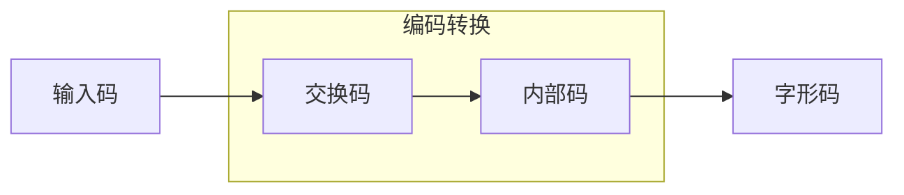

# 计算机中信息的表示

## 考点

- 数制及其转换
- 数值的编码表示
- 字符的编码表示

计算类问题考察

## 目标

1. 掌握二进制计算规则 **
2. 掌握不同数制的转换方法 ***
3. 掌握西文编码、汉字编码和数值在计算机中的表示 ***

这一节涉及到计算内容，需要掌握内容多，考察频繁，相对重要。

## 1. 二进制的优势

不管是什么样的数据，在计算机中都是以二进制编码进行存储和处理的。
任何形式的数据，输入到计算机中，都必须进行 0 和 1 的二进制编码转换。
二进制在计算机中的优势主要体现在以下几个方面：

1. **易于表示，技术实现简单**；

  > 逻辑电路只有两种状态，断开和闭合，也就是0 和 1。因此二进制非常适合计算机的逻辑运算和数据存储

2. **运算规则简单**；

  > 与十进制相比，二进制的运算规则要简单很多。
  > 二进制的加减乘除都可以通过简单的位运算来实现。
  > 不仅可以简化计算机内部的结构，也有利于提高计算效率。

3. **适合逻辑运算**。

  > 0 和 1 可以直接对应于逻辑运算中的真和假，这使得二进制在逻辑运算中表现出色。
  > 为计算机内部逻辑运算提供了便利。

4. **可靠性高**。

  > 由于只有 0 和 1 ，即使在传输过程中受到一定程度干扰，只要能够区分这两种状态，就能保证数据的正确性。

## 2. 数制
### 2.1 概念与特点

- **数制**，即进位计数制，是指用一组固定的数码和统一的进位规则来表示数值的方法。 其核心特点是：**表示数值大小的数码，其实际代表的数值与其在数中所处的位置（数位）有关**。

- **数码**，是一组用来表示某种数制的符号。
> e.g.
  > 二进制：0 和 1
  > 八进制：0-7
  > 十进制：0-9
  > 十六进制：0-9 和 A-F

- **基数**，数制中数码的个数。
> e.g.
  > 二进制：基数为 2
  > 八进制：基数为 8
  > 十进制：基数为 10
  > 十六进制：基数为 16

- **位权**，数码在数中所处位置的权值，底数为**基数**，指数由位置决定。 整数部分，数位从**个位**开始，依次为 0, 1, 2, ... 向高位递增； 小数部分，数位从**十分位**开始，依次为 -1, -2, -3, ... 向低位递增。

即：
    $$位权 = 数字 \times 基数^{(数位-1)}$$

$e.g.$

**十进制 123 ：** 
位权 = 数字 $\times 10^{(数位-1)}$ 
2 的位权 = $2 \times 10^{(2-1)} = 20$
3 的位权 = $3 \times 10^{(1-1)} = 3$ 
**二进制 10 ：** 
位权 = 数字 $\times 2^{(数位-1)}$ 
1 的位权 = $1 \times 2^{(2-1)} = 2$
0 的位权 = $0 \times 2^{(1-1)} = 0$

### 2.2 数制表示方法

1. 数字后加英文字母
    - B：二进制
    - O：八进制
    - H：十六进制
    - D：十进制（一般省略）

2. 在括号外加下标
    如：$(1010)_2$ 表示二进制数 1010
    以此类推

## 3. 二进制数字的运算

### 3.1 算术运算

- **加法**：<small>逢二进一</small> 与十进制类似，二进制加法也有进位规则。 0 + 0 = 0；0 + 1 = 1；1 + 0 = 1；**1 + 1 = 10** （即结果为 0，向高位进 1）。

- **减法**：<small>借一当二</small> 二进制减法也有借位规则。 0 - 0 = 0；1 - 0 = 1；1 - 1 = 0；**10 - 1 = 1（借位）** （即结果为 1，向高位借 1）。

### 3.2 逻辑运算

- **与运算**（AND）： 只有当两个操作数的对应位都为 1 时，结果才为 1，否则为 0。
    $0 \land 0 = 0$
    $0 \land 1 = 0$;  $1 \land 0 = 0$
    $1 \land 1 = 1$  

- **或运算**（OR）： 只要两个操作数的对应位中至少有一个为 1，结果就为 1，否则为 0。
    $1 \lor 1 = 1$
    $0 \lor 1 = 1$;  $1 \lor 0 = 1$
    $0 \lor 0 = 0$  

- **非运算**（NOT）： 对单个操作数进行运算，将 0 变为 1，1 变为 0。
    $\lnot 0 = 1$
    $\lnot 1 = 0$  

- **异或运算**（XOR）： 当两个数的位不同时，结果为 1； 当两个数的位相同时，结果为 0。
    $0 \oplus 0 = 0$ ; $1 \oplus 1 = 0$
    $0 \oplus 1 = 1$ ; $1 \oplus 0 = 1$  

## 4. 进制转换

### 4.1 R 进制转十进制

方法：**位权展开求和**

将 R 进制数按位权展开，然后按照十进制规则进行求和计算。
其结果就是转换后对应的十进制数。

$e.g.$ 

$B = 10110$
$D = 0 \times 2^0 + 1 \times 2^1 + 1 \times 2^2 + 0 \times 2^3 + 1 \times 2^4$
$D = 18$

或者

$O = 52$
$D = 2 \times 8^0 + 5 \times 8^1$
$D = 42$

### 4.2 十进制转 R 进制

由于整数部分和小数部分的转换方法不同，因此，需将两者分别转换后，再合并。

#### 整数部分

方法：**除 R 倒取余**

整数除以R,得到商和余数，直到商为 0 为止；
先得到的余数作为高位，后得到的为低位<small>（倒取余）</small>

#### 小数部分

方法：**乘 R 正取整** 
R 乘十进制小数
如此一来得到积，**取整**
再用 R 乘余下的小数部分，再进行相同操作
直到小数部分为0
先取整为高有效位；后取整为低有效位。

### 4.3 八和十六进制的转换

#### 二进制转换成八进制

方法：**三位变一位**

从小数点位置开始，整数部分向左、小数部分向右，每三位二进制分为一组，不足三位时用 0 补足。 这时，每组对应一位八进制数。

> xxxx.xxx => 00x xxx.xxx

其中，数码对应关系如下表： 
轮椅打法，闲着没事就背，但没人建议这么做。

| O | B | O | B |
|---|---|---|---|
| 0 | 000 | 4 | 100 |
| 1 | 001 | 5 | 101 |
| 2 | 010 | 6 | 110 |
| 3 | 011 | 7 | 111 |

还有一种解法：“ **421 法** ”。 
也就是直接通过二进制位的权重，快速计算该位八进制对应值的方法。

原因：<small>_（了解即可）_</small>
三位二进制能表示的范围如是，即八进制的数码。

_其他转换过程同理。_

#### 二进制转换成十六进制

方法：**四位变一位**

同理。

> xxxxx.xxx => 000x xxxx.xxx0

数码对应关系...一定没有人希望背下十六对 ABCD0101 吧？

因此，直接用 **权重法** 。
其实就是此前说过的 **“421 法”**。它基于位权计算。如果统一命名，可以叫做“8421法”，但应该也没人希望这么叫。

#### 八进制转换成二进制

将每一个八进制数转换为 **三位二进制数** 。
转换后，去掉首尾多余的 0 。

当然，可以参考上面的表直接往里填，也可以去依次手算。

#### 十六进制转换成二进制

将每一个十六进制数转换为 **四位二进制数** 。

## 5. 有符号数和无符号数

可以区分正负类型的数，称为 **有符号数**；
反之，只表示非负整数的数，称为 **无符号数**。

### 原码、反码和补码

三者都是有符号数。

为了表示数字的正负，通常把一个数的 **最高位** 定义为符号位。
用 `0` 表示正，`1` 表示负，其余位表示数值。

在求解原码、反码和补码时，如果没有特殊说明，默认 **字长为 8 **。

#### 原码

存在符号位，且剩下的位置用绝对值表示的码。

$e.g.$
$+5 = (0\ 000\ 0101)_2$
$+127 = (0\ 111\ 1111)_2$

这也说明了为什么 8 位长最高表示为 127：
最高位被用于表示正负了。

#### 反码

正数的反码 **是其本身** ；
负数的反码是符号位不变，其余位按位取反。

$e.g.$
$+13_{10} = +1101_2$，其反码为 $0\ 0001101_2$（符号位为0，数值位为原码）。
$-13_{10} = -1101_2$，其反码为 $1\ 1110010_2$（符号位为1，数值位按位取反）。

#### 补码

正数的补码 **是其本身** ；
负数的补码是 **该数的反码 + 1**

## 6. 西文编码

`ASCII` ：**美国信息交换标准代码** 

- **地位** ：被 **国际标准化组织** （ISO）指定为国际标准，是国际上使用最广泛的字符编码。

- **占用** ：一个 ASCII 码在计算机内通常用 **一个字节**（8 位）表示。

- **特征** ：在标准情况下，其最高位（第 8 位）为 **0**。
当系统需要进行错误检测时，该位可被用作 **奇偶校验位**，用于存放校验值。

标准的 ASCII 码采用 7 位二进制编码，可以表示 128 个字符。
这些字符分为两大类：

- **普通字符** ：可视，可打印，用以描述信息；

- **控制字符** ：不可视，不可打印，用以控制内容。

因此，**“所有 ASCII 都可以被打印”** 之论是错误的。

- **规律** ：0-9 => A-Z => a-z
ASCII $_{\text{小写}}$ = ASCII $_{\text{大写}}$ + 32

常见 ASCII 码：

| 字符 | 二进制编码 | 十进制编码 <small>需要记忆</small> | 十六进制编码 |
| :--- | :--- | :--- | :--- |
| 0 | 00110000 | 48 | 0x30 |
| A | 01000001 | 65 | 0x41 |
| a | 01100001 | 97 | 0x61 |
| space | 00100000 | 32 | 0x20 |

`ExASCII` ：扩展 ASCII 码

7 位不够导致的。它将最高位纳入表示范围，可以表示 **256** 个字符。 

考不多，没有 “标准 ASCII” 描述（如只描述了“ASCII码”）时，考虑 ExASCII 。

## 7. 汉字编码

有四类编码：

### 输入码

也叫 **外部码（外码）** ，主要用于汉字的输入。可理解为“输入法”。
输入码有多种。衡量输入码方法好坏的依据：

- 编码短，击键次数少；
- 重码少，盲打便捷；
- 好学好记。

但很可惜，目前常见的输入方案中，无一满足。
输入码的类别有以下几种：

- 音码
  - 好处：你会拼音不？
  - 坏处：重码率奇高。

- 形码：如五笔字型法、郑
  - 好处：重码少，单字输入快
  - 坏处：难...

- 数字编码（区位码）：
  **原理**：用数字串输入汉字。把常用汉字分为 94 个区块的巨大表格，通过索引输入对应汉字。
  行为区，列为位，x区x位确定一个汉字，通过xxxx来表示。

### 内部码

又称“机内码”。
特点：内部码的每个字节最高位是 `1` 。
内部码和国标码、区位码的换算公式为：
$$
内部码 = 国标码 + 0x8080 = 区位码 + 0xA0A0
$$

### 字形码

也叫 **输出码** 或 **汉字字模** 。
分为 **点阵式** 和 **矢量式** 。

#### 点阵式

一组二进制来声明一套点阵，一个点占用一个二进制位。

- 特点：简易汉字为 16×16 点阵，提高点阵为 24×24、32×32、48×48 等。
  点阵越大，描述的字形越细致，质量越高，所占存储空间也越大。

点阵的所占字节数公式：

$$
S = \frac{\text{点阵行数} \times \text{点阵列数}}{8}
$$

#### 矢量式

仅描述汉字的轮廓特征，类似矢量图。
不会失真，且占用相对较小。

### 交换码

又称国标码。现仍通行 _GB2312_ 标准。
一个国标码占 **2 字节**，每字节最高位为 `0` 。
区位码转国标码：十进制区号和十进制位号分别转为十六进制，再分别 **+ 0x20**。
即：

$$国标码 = 区位码 + 0x2020$$

各类型编码的工作流程如下：

## 8. 数据单位

位（b/bit）最小单位。每个01为一bit

字节（B）基本单位 = 8b

字（word），字节整倍数，具体量与字长有关，见下：
  字长：计算机同时处理信息的二进制的位数。
  e.g. 64位，即 1 word = 64b

1B = 8b
1KB = 1024B = $2^{10}$ B
1MB = 1024KB = $2^{20}$ B
1GB = 1024MB = $2^{30}$ B
1TB = 1024GB = $2^{40}$ B
