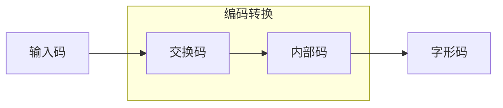
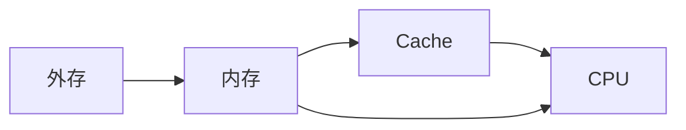

# 计算机基础知识

## 计算机技术概论

### 计算机的概念

> 计算机，又称“电脑”，是一种具有计算功能、记忆功能和逻辑判断功能的机器设备。它能接收数据，保存数据，按照预定的程序对数据进行处理，并提供和保存处理结果。

### 计算机的起源

1. Q: 世界上第一台通用电子计算机
	1. 时间：1946 年 2 月
	2. 地点：美国宾夕法尼亚大学
	3. 人物：莫奇利、埃克特（冯·诺依曼后续加入）
	4. 命名：ENIAC

2. Q: ENIAC 的特点（缺点）
	1. **5k 次/s** 加法运算
	2. **没有**存储器
	3. 采用**十进制** ⚠️ 切记！ENIAC *不是*二进制！！
	4. 主要元器件为**电子管**
	5. 最初用于**弹道计算**

3. Q: 冯·诺依曼方案
	1. 贡献：1954 年提出 EDVAC
	2. 地位：现代计算机之父
	3. 思想：
		- 采用二进制
		- **存储程序**
		- 五大部分：运算器、控制器、存储器、输入设备、输出设备

4. Q: 图灵
	1. 地位：计算机科学之父、人工智能之父
	2. 贡献：图灵机模型

5. Q: 计算机工作原理
	1. 存储程序和程序控制

### 计算机的发展

6. Q: 计算机发展的分类依据
	1. **电子元器件**

| 世代 | **电子元器件** | 运算速度 | 语言 | 应用 |
| --- | --- | --- | --- | --- |
| 第一代 <small>1946-1956</small> | 电子管 | 几千次/秒 | 机器语言、汇编语言 | 军事领域、科学计算 |
| 第二代 <small>1956-1964</small> | 晶体管 | 几十万/秒 | 高级语言 | 数据处理、工业控制 |
| 第三代 <small>1964-1971</small> | 中小规模集成电路 | 几百万/秒 | 操作系统 | 各个领域 |
| 第四代 <small>1971-至今</small> | 大规模、超大规模集成电路 | 上亿次/亿亿次/秒 | 数据库、计算机网络 | 网络时代 |

### 计算机的特点

7. Q: 计算机的特点
	1. 运算速度**快**
	2. 计算精度**高**
	3. 存储容量**大**
	4. 具有逻辑判断能力
	5. 工作自动化
	6. 通用性强

### 计算机的分类

8. Q: 按照性能划分
	1. 巨型机（超级计算机）
		- 极高处理速度、极大存储容量和强大通信能力
		- 主要用于科学计算等高端计算领域
		- 国家尖端科技水平
		- 例：银河、天河、神威·太湖之光
	2. 大型机
		- 极强的综合处理能力
		- 可以处理大量复杂任务
		- 可靠性高，可容纳大量用户
		- 主要应用在政府部门、金融、大型企业等
	3. 小型机
		- 介于大型机与微型机
		- 中型企业数据处理、科学计算
		- 性能价格相对平衡
		- 适合需求性能但预算有限者
	4. **微型机**
		- 也即“个人计算机”
		- 广泛应用于各个领域
		- 性能价格体积变化范围大
	5. 工作站
		- 高性能计算机
		- 应用于图形设计、科学计算等专业领域
		- 强大计算能力和图形处理能力
		- 多用户并发操作支持
		- 价格通常较高，但性能更强

9. Q: 按照工作原理（处理对象）划分
	1. 模拟计算机
	2. 数字计算机
	3. 混合计算机

10. Q: 按照功能用途划分
	1. 通用计算机
		- 执行各类程序的计算机
		- 用途广泛，适用面广
		- 多种处理器，大容量存储
		- 支持各类软件与操作系统
		- 普通用户计算机多属于此
	2. 专用计算机
		- 专为特定任务或应用设计的计算机
		- 特定软硬件配置
		- 特定领域效率更高且更可靠

### 计算机的应用

11. Q: 科学计算/数值计算
	1. **举例**：人造卫星轨道计算、天气预报、地震分析、火箭和宇宙飞船设计等
	2. **地位**：是计算机最早的应用领域之一 <small>ENIAC</small>
	3. **特点**：计算工作量大，数值变化范围大

> **辨析**：科学计算**难且高大上**，主要用于科研等场景

12. Q: 数据处理/信息管理
	1. **举例**：人事管理、财务管理、商业数据交流、情报检索、库存管理等
	2. **地位**：是计算机应用最广泛的领域
	3. **特点**：涉及的数据量大，但计算方法相对简单

> **辨析**：信息管理**简单且普遍**，更多见于日常生活

13. Q: 计算机辅助技术
	1. **定义**：通过人机对话，使计算机辅助人们进行设计、加工、计划和学习等工作
	2. **用途**：
		- 计算机辅助设计（CAD）
		- 计算机辅助制造（CAM）
		- 计算机辅助教育（CAI）
		- 计算机辅助测试（CAT）
		- 计算机辅助教育（CBE）
		- 计算机辅助教学管理（CMI）
		- 计算机集成制造系统（CIMS）

> **辨析**：考点主要在于上面的英文缩写

14. Q: 过程控制/实时控制
	1. **定义**：又称“实时控制”，用计算机及时采集监测数据，按最佳值迅速地对控制对象进行自动控制或自动调节
	2. **用途**：化工、制造业、食品加工、环境监测和控制等

15. Q: 人工智能
	1. **定义**：通过计算机来模拟人类的某些智能活动，如图像和语言的识别、逻辑推理能力等

16. Q: 计算机网络与通信
	1. 意义：使世界变成了一个“地球村”，极大地促进了信息的交流和共享

17. Q: 多媒体
	1. 应用：广泛应用于文化教育、娱乐、商业应用等领域

18. Q: 嵌入式系统
	1. **定义**：以应用为中心，以计算机技术为基础，软硬件可裁剪的专用计算机系统
	2. **用途**：家电、汽车、医疗设备等领域
	3. **特点**：对功能、可靠性、成本、功耗和体积有特殊要求

### 计算机的发展趋势

19. Q: 巨型化
	1. 不断研制速度**更快**、存储量**更大**、功能**更强**的计算机，以满足科学研究、军事和工业等领域对高性能计算的需求
	2. ⚠️ 巨型化是功能追求更强，但不能说是体积越大越好

20. Q: 微型化
	1. 利用微电子技术和超大规模集成电路技术，研制体积**更小**、性能**更强**、价格**更低**的计算机
	2. 各种笔记本电脑和掌上电脑大量使用，是计算机微型化的一个标志

21. Q: 网络化
	1. 将计算机和相关装置连接在一起形成网络
	2. 作用不仅在资源共享，还提供了分布式的计算平台，极大提高计算机系统的处理能力

22. Q: 智能化
	1. 指计算机具有模拟人的感觉和思维过程的能力
	2. 包括模式识别、物形分析、自然语言理解、专家系统等方面的研究和应用

## 计算机中信息的表示

### 有符号数和无符号数

23. Q: n 位无符号二进制数的表示范围
	1. $[0, 2^n - 1]$

24. Q: n 位有符号二进制数的表示范围
	1. $[-2^{n-1}, 2^{n-1} - 1]$

### 西文编码

25. Q: 西文编码的方式
	1. 7 位二进制编码
	2. 表示 128 位字符
	3. 1 个 ASCII 在计算机内用一个字节（B，8 位）表示

26. Q: 常见打印字符的 ASCII 码

| 字符 | ASCII |
| --- | --- |
| 空格 | 32 |
| 0 | 48 |
| A | 65 |
| a | 97 |

	- 对于特定字母：小写字母在大写字母后 32 位

### 汉字编码

27. Q: 汉字编码遵循的流程

28. Q: 汉字编码的基本术语
	1. 输入码
		- 键盘输入汉字时的编码信息
		- 类型：音码（全拼、双拼等）、形码（五笔）、区位码
	2. 机内码（内部码）
		- 为了存储、处理汉字而转换的形式
		- 计算公式：$机内码 = 国标码 + 8080_H = 区位码 + A0A0_H$
	3. 字形码
		- 为了将汉字表现在显示器输出所使用的形式
		- 方式：点阵式、矢量式
	4. 国标码（交换码）
		- 计算机与其他系统或设备进行信息、数据交流时要用到的形式
		- 遵循 **GB-2312-80** 标准
		- 每个汉字占**两个字节**
		- 计算公式：$国标码 = 区位码 + 2020_H$

> **辨析**：区位码为两个 10 进制数，分别为区码（行）和位码（列）。因此，在参与上述计算时，区码和位码要分别化为 16 进制数字。

## 计算机系统的组成

29. Q: 冯·诺依曼原理
	1. 存储程序与程序控制
30. Q: 指令的组成
	1. 操作码
	2. 操作数

31. Q: 指令的特征
	1. 不同的 CPU，规定的指令格式也不相同。

32. Q: 程序的概念
	1. 一系列有序的指令集合

33. Q: 计算机的工作过程
	1. 取指令
	2. 分析指令
	3. 执行指令
	4. 指令计数器 + 1

### 硬件系统

#### 输入设备

34. Q: 常见的输入设备
	1. 鼠标
	2. 键盘
	3. 扫描仪
	4. 模数转换器（A/D）
	5. etc.

#### 输出设备

35. Q: 常见的输出设备
	1. 显示器
	2. 打印机
	3. 音箱
	4. 绘图仪
	5. 数模转换器（D/A）

> **辨析**：触摸屏、光盘驱动器不仅是输出设备，也是输入设备

#### 运算器

36. Q: 运算器的组成
	1. 算术逻辑单元（ALU）
	2. 寄存器

37. Q: 寄存器的特点
	1. 读写极快
	2. 容量很小
	3. 临时存放

#### 存储器

38. Q: 存储器的分类
	1. 内存
	2. 外存

39. Q: 内存的分类
	1. 只读存储器（ROM）
		- 用于存放固定的程序数据（e.g. BIOS）
		- 断电后能长期保存
	2. 随机存储器（RAM）
		- 用于存放正在执行的程序与数据
		- 断电后数据丢失
		- 分类
			- 静态随机存储器（SRAM）
			- 动态随机存储器（DRAM）<small>与<b>“周期性刷新电路”</b>有关</small>
	3. 高速缓冲存储器（Cache）
		- 介于 CPU 和内存之间的可高速存取信息的芯片
		- CPU 和 RAM 之间的桥梁

40. Q: 存储器数据流向

### 软件系统

#### 系统软件

41. Q: 系统软件包括哪些
	1. 操作系统
	2. 语言处理程序
		- 机器语言（面向机器硬件的语言）
		- 汇编语言
		- 高级语言
			- 解释型
			- 编译型
	3. 系统支撑和服务程序
	4. 数据库管理系统
		- MySQL
		- Access
		- Visual Fox Pro
		- etc.

## 微机系统

### 微机系统性能指标

1. 主频（时钟频率）
	1. 单位
		- 赫兹（Hz）
		- 常用 MHz、GHz 等。

2. 字长
	1. 概念
		- CPU 一次能处理二进制数的位数
	2. 决定因素
		- 数据总线的宽度
3. 存储容量（主要讨论**内存**）
4. 存取周期
5. 运算速度
	1. 单位
		- MIPS（每秒百万条指令）
		- BIPS（每秒十亿条指令）
6. 内核数
	1. 对于“多核多线程”：
		- “核”是指**运算器**
		- “线程”是指**控制器**

### 常见微机硬件设备

#### 内存

1. 组成
	1. 和 CPU 一起组成**主机**
#### 外存

1. 软盘
	1. 特征
		- 具备写保护口

2. 硬盘
	1. 硬盘的存储容量计算$$存储容量=盘片\times面数\times磁道数\times扇区数\times512字节$$
	2. 优点
		1. 由芯片组成
		2. 读写速度快
		3. 抗震性佳
		4. 无噪音
		5. 发热小
	3. 缺点
		1. 价格高
		2. 容量小
		3. 寿命有限

3. 可移动存储器
	1. U 盘
	2. 移动硬盘

4. 光盘
	1. 优点
		1. 成本低
		2. 存储密度高
		3. 可靠
		4. 耐用
	2. 缺点
		1. 读取速度和数据传输速度比硬盘慢
	3. 分类
		1. CD-ROM（只读）
		2. CD-R（写一次）
		3. CD-RW（可擦写）

#### 主板

1. 主板上的芯片
	1. BIOS
	2. CMOS
2. BIOS 芯片
	1. ROM
	2. 存储 BIOS 程序
3. CMOS 芯片
	1. RAM
	2. 通过主板纽扣电池单独供电 <small>因此关机后数据不会丢失，它又不关</small>
	3. 保存 BIOS 设置的各项硬件配置参数

#### CPU

#### 总线

1. 概念
	1. 各功能部件之间传输信息的公共通信干线
2. 分类
	1. 按照数据处理方式
		- 串行
		- 并行
	2. 按照数据处理类型
		- 数据总线
		- 地址总线
		- 控制总线

| 总线类型                   | 传输方向 |
| ---------------------- | ---- |
| 数据总线 <small>DB</small> | 双向   |
| 地址总线 <small>AB</small> | 单向   |
| 控制总线 <small>CB</small> | 双向   |

3. 寻址空间和地址总线的计算公式 设地址总线为 $N$ 位：$$寻址空间=2^{N}B$$

4. 数据总线的指标
	1. 根数（宽度）表示 CPU 可一次性接收或者发出多少位二进制数
	2. **数据总线决定字长**

5. 常见的总线
	1. PCI
	2. AGP（加速图形端口）
	3. USB
	4. ISA（早期）

#### 接口

1. USB
2. IEEE1394
3. HDMI

#### 基本输入设备

1. 鼠标
	1. 分类
		- 机械
		- 光电
		- 轨迹球
	2. 接口
		- PS/2 绿色
		- USB

2. 键盘
	1. 接口
		- PS/2 紫色
		- USB

3. 触摸屏
4. 扫描仪

#### 基本输出设备

1. 显示器
	1. 参数
		- 分辨率
		- 颜色质量
		- 响应时间
	2. 色彩位深度换算颜色数量 若颜色质量为 $N$ 位：$$颜色数量=2^{N}种$$ 
2. 打印机
	1. 参数
		- 打印速度 
		- 分辨率
	2. 类型
		- 点阵打印机 / 击打式打印机 / 针式打印机
		- 激光打印机
		- 喷墨打印机